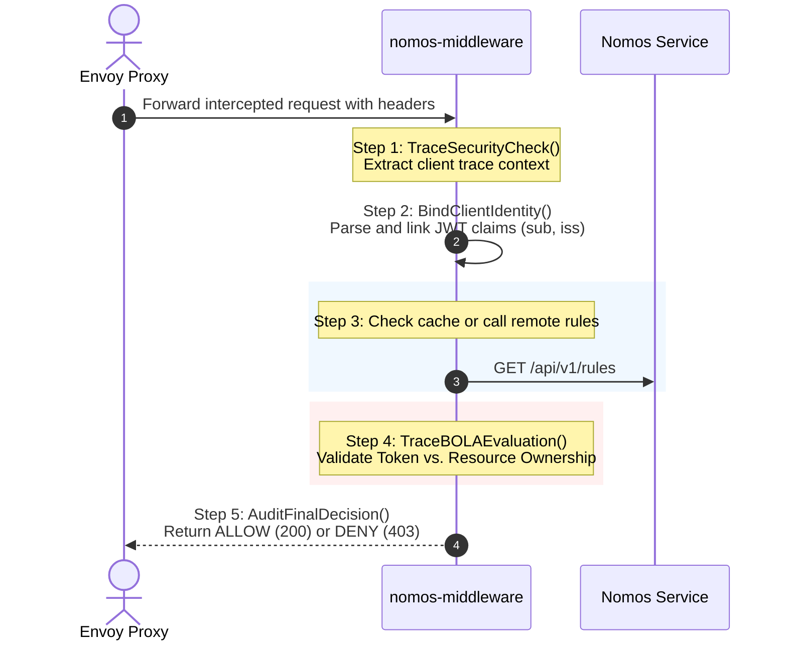

# 🛡️ Security Tracing & Audit Focus Guide: `nomos-middleware`

This guide outlines the critical focus areas and telemetry mapping required to implement **Audit Trail Preservation** and **BOLA/IDOR Threat Detection** within the `nomos-middleware` external authorization container.

---

## 🎯 1. Baseline Strategy: The Trace Lifecycle
To establish a fully auditable stream of auth decisions, security teams need a sequential map showing exactly who asked for access, what policies were matched, and why the request was allowed or blocked.

---

## 🔍 2. Critical Focus Areas

### 🚨 A. BOLA / IDOR Protection (The Highest Priority)
* **What it targets:** A valid tenant attempting to access resources belonging to a different tenant (e.g., Calling `/v1/customer/Bob` using Alice's token).
* **Telemetry Focus:**
  * **Assert Path vs. Claim:** Capture both the parameter extracted from the path (e.g., `msisdn`) and the verified value extracted from the JWT json path.
  * **Security Violation Flag:** Use a dedicated boolean field `security.authz_violation = true` rather than basic logs so it immediately floats to the top of SIEM search indices.
  * **Remediation Tracking:** Log the action taken (`DENY_ACCESS`) to satisfy compliance audits.

### 🔑 B. Immutable Client Identity Binding
* **What it targets:** Establishing non-repudiation without leaking sensitive credentials.
* **Telemetry Focus:**
  * Parse and attach the standard OpenTelemetry user attributes:
    * `enduser.id` (`sub` / Tenant identifier)
    * `enduser.issuer` (`iss` / Identity Provider origin)
    * `enduser.audience` (`aud` / Application client)
  * Do **not** log raw bear tokens, cookies, or signatures on trace spans.

### 🔄 C. Dynamic Enrichment Trust Audit
* **What it targets:** Dynamic Level 2 validation checks fetching metadata from external endpoints (such as retrieving dynamic subscriber profiles).
* **Telemetry Focus:**
  * Audit the duration, response status, and address of the external enrichment target.
  * If the enrichment endpoint fails or responds with a mismatch, trace the exact failure stage (e.g., `ENRICHMENT_FAILURE`) so security teams can differentiate between a connectivity issue and an active attack.

---

## 📊 3. Metric & SIEM Mapping Key

When forwarding these trace attributes to your SIEM system (e.g. Datadog, Splunk, Elastic), configure alerts for the following patterns:

| Metric / Alarm | Target Attribute | Description | Action Required |
| :--- | :--- | :--- | :--- |
| **BOLA / IDOR Violation** | `security.violation_type == "BOLA_IDOR_ATTEMPT"` | Client tried to access resources belonging to another tenant identifier. | **High Alert:** Block source IP and check credentials. |
| **Token Tampering** | `security.event == "token_tampering_attempt"` | Token sent has a malformed base64 structure or invalid syntax. | **Medium Alert:** Inspect client application for bugs or injection tests. |
| **Privilege Escalation** | `security.audit.failure_stage == "L2_OWNERSHIP_VERIFICATION"` | General resource ownership mismatches on critical assets. | **High Alert:** Verify authorization policy structure. |
| **Trust Source Interruption** | `security.audit.failure_stage == "ENRICHMENT_FAILURE"` | A critical authentication/enrichment provider is offline or timed out. | **Critical Alert:** Check outbound firewalls and status of IdP providers. |

---

> [!TIP]
> **Implementation Best Practice:** Keep tracing logic asynchronous and isolated from the primary request thread path to ensure that any tracing latency doesn't impact the performance of the external authorization middleware.
