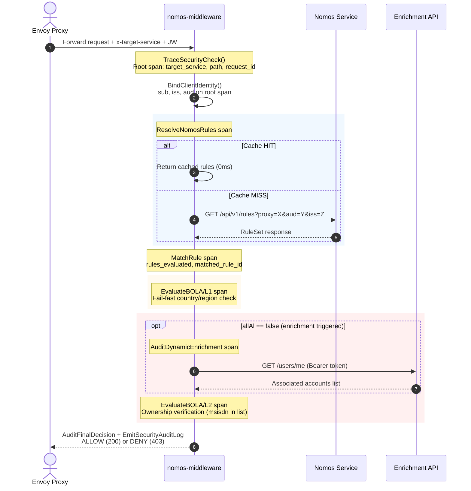

# 🛡️ Security Tracing & Audit Focus Guide: `nomos-middleware`

This guide outlines the critical focus areas and telemetry mapping required to implement **Audit Trail Preservation** and **BOLA/IDOR Threat Detection** within the `nomos-middleware` external authorization container.

---

## 🎯 1. Trace Waterfall Architecture

Every authorization request produces a structured span tree. This is the target waterfall
visible in Jaeger/Tempo/X-Ray when inspecting a single request:

```
AuthorizationCheck (root — server span)
 ├── ResolveNomosRules (client span — network or cache)
 ├── MatchRule (internal span)
 ├── EvaluateBOLA/L1/country (internal span)
 ├── AuditDynamicEnrichment (client span — if triggered)
 ├── EvaluateBOLA/L2/msisdn (internal span)
 └── FinalDecision: ALLOW or DENY
```



---

## 🔍 2. Critical Focus Areas (Priority Matrix)

### Priority: CRITICAL

#### A. Root Span Context (`TraceSecurityCheck`)

Without `target_service` and `original_path` on the root span, you **cannot filter traces by service** in any backend (Jaeger, Tempo, X-Ray).

| Attribute | Source | Why Critical |
|-----------|--------|--------------|
| `nomos.target_service` | `x-target-service` header | Filter: "show all denials for account-service" |
| `http.target` | `x-original-uri` / `x-original-path` | Filter: "show all requests to /accounts/*/balance" |
| `http.method` | `x-original-method` | Distinguish GET vs POST to same path |
| `nomos.request_id` | `x-request-id` (Envoy propagated) | Correlate across services in the mesh |

#### B. Nomos Resolution Span (`TraceNomosResolution`)

This is the **primary external dependency**. Without this span, you cannot distinguish latency sources:

| Attribute | Purpose |
|-----------|---------|
| `nomos.cache_hit` | Determines if latency is from network or logic |
| `nomos.resolution_ms` | Baseline: <1ms cached, 2-10ms network |
| `nomos.failure_type` | Classification: `TIMEOUT`, `UNREACHABLE`, `ACCESS_DENIED`, `UNKNOWN` |
| `nomos.rules_returned` | Sanity check — 0 rules + deny policy = blocked |

Error classification logic (as seen by the middleware):
```
403 from Nomos     → ACCESS_DENIED (audience/proxy mismatch)
Timeout/deadline   → TIMEOUT (Nomos service unresponsive)
Connection refused → UNREACHABLE (pod down, DNS failure)
Other              → UNKNOWN (investigate)
```

> **Note:** The middleware has no visibility into Neo4j. A `TIMEOUT` could be caused by Neo4j being overloaded, but the middleware only sees "Nomos didn't respond in time." Neo4j latency is a Nomos-side concern — check Nomos service logs and Neo4j metrics when this alert fires.

---

### Priority: HIGH

#### C. Rule Matching Span (`TraceRuleMatch`)

Operators' #1 question during incidents: **"why was this path denied?"** — often the answer is "no rule matched".

| Attribute | Purpose |
|-----------|---------|
| `nomos.rules_evaluated` | How many rules were compared |
| `nomos.matched_rule_id` | Which rule won (if any) |
| `nomos.matched_pattern` | The pattern that matched (e.g., `/{country}/accounts/{msisdn}/balance`) |
| `nomos.no_rule_match` | Boolean flag when nothing matched — triggers `defaultPolicy` |
| `nomos.original_path` | The actual path that was tested |

#### D. Structured Audit Log Fallback (`EmitSecurityAuditLog`)

OpenTelemetry collector may not be deployed on day one. The structured audit log provides **immediate observability** with just `kubectl logs` + any log aggregator:

```json
{
  "ts": "2026-08-03T13:15:00.123Z",
  "rid": "abc-123-def",
  "svc": "account-service",
  "path": "/py/accounts/595981123456/balance",
  "method": "GET",
  "sub": "user-abc-123",
  "iss": "https://auth0.example.com",
  "aud": "mobile-br-auth0-client",
  "rule": "rule-acct-auth0-001",
  "pattern": "/{country}/accounts/{msisdn}/balance",
  "decision": "DENY",
  "reason": "L2_OWNERSHIP_VERIFICATION_FAILED",
  "dur_ms": 3,
  "cache_hit": true,
  "enriched": true
}
```

This single JSON line answers: **who** accessed **what**, was it **allowed**, and **why** — without needing a trace backend.

---

## 🚨 3. BOLA/IDOR Detection (`TraceBOLAEvaluation`)

### What it detects
A valid authenticated user attempting to access resources belonging to a **different** user/account. This is OWASP API Security Top 1 (API1:2023).

### Telemetry per validation

| Attribute | Value (violation) | Value (pass) |
|-----------|-------------------|--------------|
| `security.authz_violation` | `true` | `false` |
| `security.violation_type` | `BOLA_IDOR_ATTEMPT` | — |
| `security.expected_ownership` | Token claim value | — |
| `security.target_resource` | Path/query value | — |
| `security.bola.validation_type` | `equals` or `contains` | `equals` or `contains` |
| `security.validation_level` | `1` or `2` | `1` or `2` |
| `security.remediation_action` | `DENY_ACCESS` | — |

### Span naming convention
Spans are named with level and parameter for instant filtering:
- `EvaluateBOLA/L1/country`
- `EvaluateBOLA/L2/msisdn`

---

## 🔄 4. Dynamic Enrichment Audit (`TraceDynamicEnrichment`)

### When it fires
Only when `allAl == false` in the JWT — meaning the token doesn't carry the full account list.

### Key attributes

| Attribute | Purpose |
|-----------|---------|
| `security.enrichment.endpoint` | Which API was called (e.g., `/users/me`) |
| `security.enrichment.source_type` | `jwtIssuer` or fixed domain |
| `security.enrichment.cache_hit` | Avoids 8x amplification on dashboard load |
| `security.enrichment.duration_ms` | Latency of the external call |
| `security.audit.failure_stage` | `ENRICHMENT_FAILURE` if the call failed |

---

## 📊 5. SIEM Alert Mapping

Configure alerts in your SIEM (Datadog, Splunk, Elastic, CloudWatch) for these patterns:

| Alert | Query | Severity | Action |
|-------|-------|----------|--------|
| BOLA Attempt | `security.violation_type == "BOLA_IDOR_ATTEMPT"` | 🔴 High | Block source, investigate token |
| Nomos Unreachable | `nomos.failure_type == "UNREACHABLE"` | 🔴 Critical | Check nomos-service pods, DNS resolution |
| Nomos Timeout | `nomos.failure_type == "TIMEOUT"` | 🟡 Warning | Check Nomos service logs, then Neo4j latency |
| Enrichment Failure | `security.audit.failure_stage == "ENRICHMENT_FAILURE"` | 🟡 Warning | Check IdP/enrichment API status |
| No Rule Match + Deny | `nomos.no_rule_match == true AND security.decision == "DENY"` | 🟡 Info | Possible missing rule configuration |
| High Latency | `nomos.resolution_ms > 50` | 🟡 Warning | Cache miss storm or Nomos degradation |
| Repeated BOLA (same sub) | `security.violation_type == "BOLA_IDOR_ATTEMPT"` count > 3 in 1min | 🔴 Critical | Automated account lockout candidate |

> **Operator note:** The middleware only measures latency to Nomos (the Quarkus service). It cannot distinguish whether Nomos is slow due to Neo4j, GC pauses, or network. Use Nomos-side metrics and Neo4j dashboards to pinpoint the root cause when timeout/latency alerts fire.

---

## 🏗️ 6. Integration Points in `main.go`

Reference for where each tracing function should be called in the `handleCheck` flow:

```go
func handleCheck(w http.ResponseWriter, r *http.Request) {
    start := time.Now()

    // ─── ROOT SPAN ───
    ctx, rootSpan := TraceSecurityCheck(r)
    defer rootSpan.End()

    // ... decode JWT ...
    BindClientIdentity(rootSpan, decodedJwt)

    // ─── NOMOS RESOLUTION ───
    resolveStart := time.Now()
    // ... fetch from cache or call nomos ...
    TraceNomosResolution(ctx, targetService, audience, issuer, cacheHit, time.Since(resolveStart), len(rulesData.Rules), err)

    // ─── RULE MATCHING ───
    matchCtx, matchSpan := TraceRuleMatch(ctx, matchedRule.ID, matchedRule.PathPattern, originalPath, len(rulesData.Rules))
    matchSpan.End()

    // ─── LEVEL 1 VALIDATIONS ───
    for _, val := range matchedRule.Validations {
        if val.Level == 1 {
            violation, bolaSpan := TraceBOLAEvaluation(matchCtx, 1, matchedRule.ID, matchedRule.PathPattern, val.ParamName, claimVal, pathVal, val.Validation)
            bolaSpan.End()
            if violation { ... deny ... }
        }
    }

    // ─── LEVEL 2 VALIDATIONS ───
    for _, val := range matchedRule.Validations {
        if val.Level == 2 {
            // Optional enrichment
            if needsEnrichment {
                enrichStart := time.Now()
                // ... call enrichment ...
                TraceDynamicEnrichment(ctx, endpoint, domainFrom, cached, time.Since(enrichStart), success, err)
            }
            violation, bolaSpan := TraceBOLAEvaluation(matchCtx, 2, matchedRule.ID, matchedRule.PathPattern, val.ParamName, claimVal, pathVal, val.Validation)
            bolaSpan.End()
            if violation { ... deny ... }
        }
    }

    // ─── FINAL DECISION ───
    AuditFinalDecision(rootSpan, true, "", "")

    // ─── STRUCTURED LOG (always emitted, no OTel dependency) ───
    EmitSecurityAuditLog(SecurityAuditEntry{
        RequestID:     requestID,
        TargetService: targetService,
        Path:          originalPath,
        Method:        originalMethod,
        Subject:       subject,
        Issuer:        issuer,
        Audience:      audience,
        MatchedRule:   matchedRule.ID,
        RulePattern:   matchedRule.PathPattern,
        Decision:      "ALLOW",
        DurationMs:    time.Since(start).Milliseconds(),
        CacheHit:      cacheHit,
        Enriched:      enriched,
    })
}
```

---

## 🔒 7. Security Constraints

- **Never log raw JWT tokens** — use `enduser.id` / `enduser.issuer` attributes only
- **Never log full cache keys** that contain tokens — truncate or hash
- **Trace spans are async-safe** — they don't block the authorization hot path
- **Audit log is single-line JSON** — compatible with CloudWatch Logs, Loki, Fluentd, Splunk
- **Enrichment cache keys** use `token_hash:endpoint` in production (not raw token)

---

> [!TIP]
> **Day-One Deployment:** Even without an OpenTelemetry Collector, the `EmitSecurityAuditLog` provides full audit coverage. Deploy the collector later and get traces as a bonus — the structured log is your safety net.
